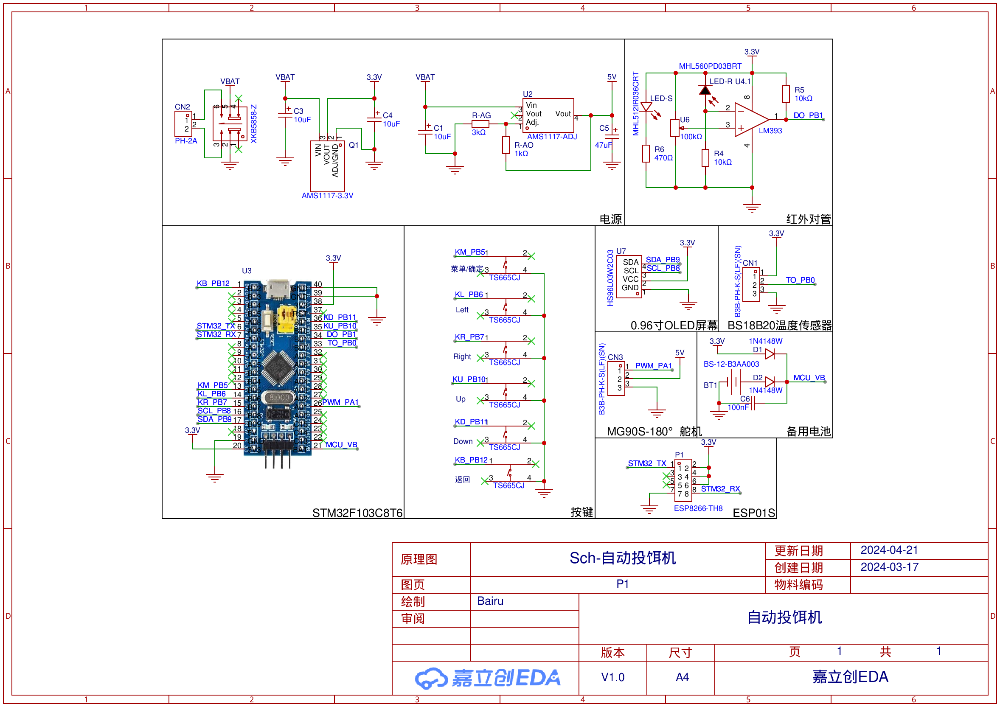

# AutoFeeding  
自动投饵机主控代码  
基于STM32F103C8T6  

#### 已实现  
- 基本UI界面  
- 时间显示  
- 温度检测  
- 定时投饵  
- 饵料余量报警  
- 自动投饵计次  
- 接入阿里云物联网平台，实现APP端与设备端数据同步  
- 开机多次配网失败则放弃配网进入主界面  
- 支持APP端控制自动投饵动作启停  

#### 修复  
- 修复进入设置页面后系统时间停止计时问题
- 修复投饵动作执行时按菜单键导致屏幕乱码问题

#### 原理图

~~ps: 这个项目代码只为实现功能，其在结构上非常混乱，而且可能有很多bug，如果有谁看到这坨“屎山”还请轻喷🤡（doge~~